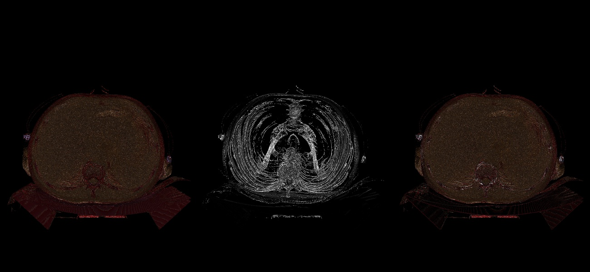
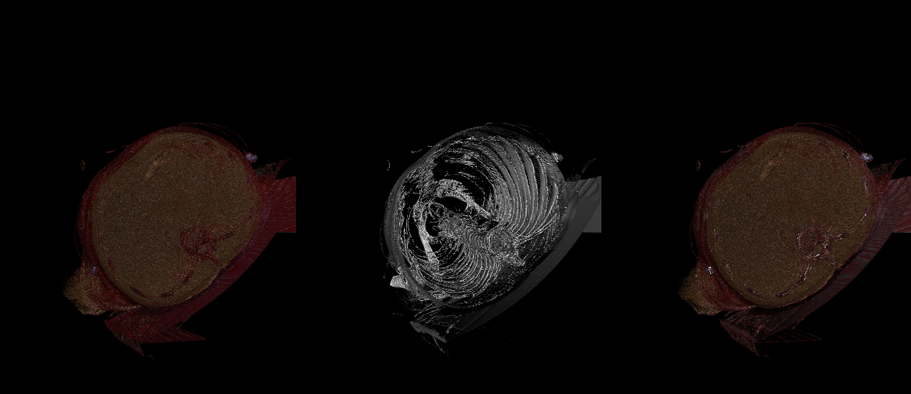
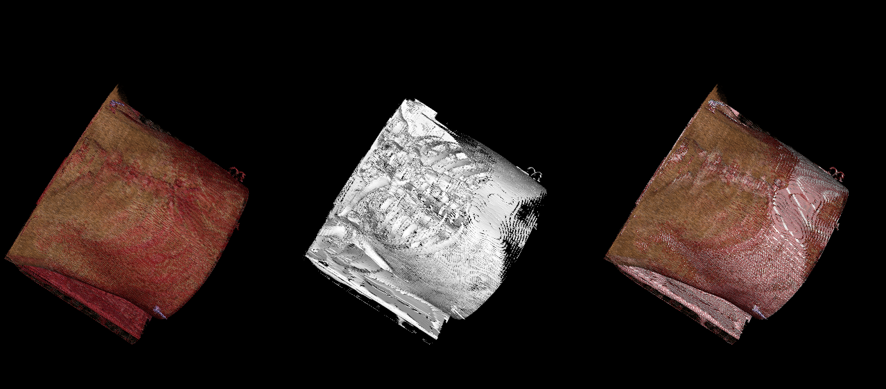

# Assignment 3 - README

## MM804 GRAPHICS AND ANIMATION

---

### About

Volume Rendering

Dataset used for medical Imaging Volume Rendering

# https://nbia.cancerimagingarchive.net/nbia-search/?MinNumberOfStudiesCriteria=1&CollectionCriteria=Lung-PET-CT-Dx

About the dataset:

The size of the dataset is 32 MB which contains a total of 64 images that are used for volume rendering of the medical images.
Dimensions of the images are 512\*512 and voxel resolution of the image is 5mm.
Min and Max pixel Intensities are 0 and 512.
Size of the individual image DICOM file is 515kb

### Output Images

### Link to the code

# https://github.com/grahul27/MM804-Assignment-3

### Reference to readme file

# https://github.com/grahul27/MM804-Assignment-3/blob/master/readme.md

### Development Environment

- Python - 3.9.0
- VTK - 9.1.0
- OS - Windows 11

### How to run

1. Open file volumeRendering.py either in Google Colab or Jupyter-Notebook and run the file for the output window to render

command - python volumeRendering.py
